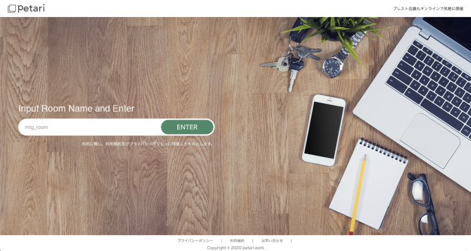
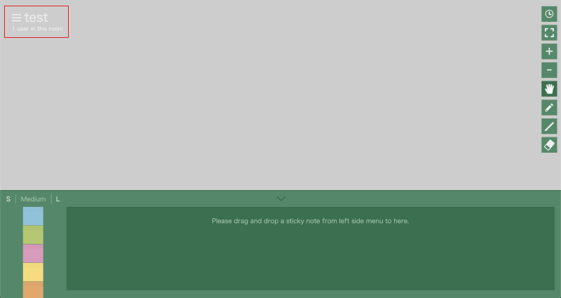
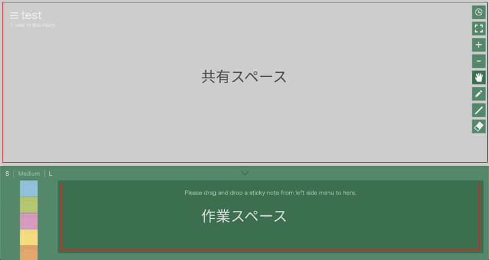
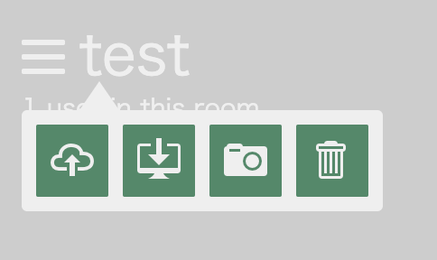
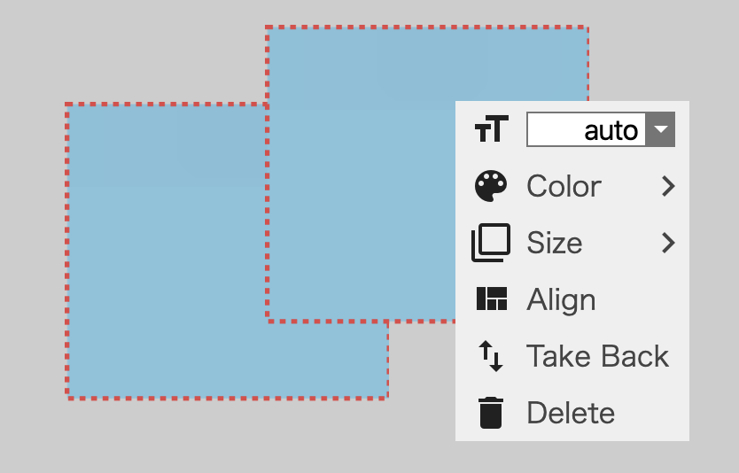

## 1-1. みんなで集まる部屋を用意する

まずは Petari にアクセスをします。

-   https://petari.work

トップにある mtg_room に好きな文字列を入力し ENTER を押してください。
部屋名が他の人とかぶると相席になるため、少し長めの部屋名の方がいいかもしれません。

## 1-2. ボードページの見方

#### 1-2-1. 共有スペースと作業スペース

画面左上に部屋名、その下に部屋にいる人数が表示されます。

ボードページは、共有スペースと作業スペースに分かれています。

|   スペース   | 用途                                     |
| :----------: | :--------------------------------------- |
| 共有スペース | 部屋に入っている全ての人が見れるスペース |
| 作業スペース | 自分のみが見れるスペース                 |

ブレストなどで最初に時間を測って付箋に書き出すときは、
一度作業スペースに付箋を書き起こし、その後話をしながら共有スペースに付箋を出していくといった
使い方が出来るようになっています。

#### 1-2-2. ツール一覧

**付箋リスト**

好きな付箋を作業スペースに持っていくためのものですが、直接共有スペースに置くこともできます
利用できる付箋は下記のサイズと色に固定されています。

| サイズ |    色    |
| :----: | :------: |
| Small  |    青    |
| Medium |    緑    |
| Large  |  ピンク  |
|        |   黄色   |
|        | オレンジ |

**ツールボックス**
右側にあるのはよく使うツール群です。

|     機能     | 概要                                           |
| :----------: | :--------------------------------------------- |
|   タイマー   | 時間を分単位で測ることができます               |
|    全表示    | 部屋内の付箋などを包括して見るときに利用します |
|  ズームイン  | ボードを拡大します                             |
| ズームアウト | ボードを縮小します                             |
|    ハンド    | 付箋を選択したり、動かしたりなどで利用します   |
|     鉛筆     | 自由に線を書くことができます                   |
|     直線     | 直線を引くことができます                       |
|   消しゴム   | 鉛筆や直線で書いた線を消すことができます       |

**ヘッダーメニュー**
ヘッダーメニューは部屋名をクリックすると見ることができます。

場所がわかりにくいので近いうちに移動させる予定です。

|     機能     | 概要                                                             |
| :----------: | :--------------------------------------------------------------- |
| アップロード | ダウンロードした JSON ファイルをアップロードできます             |
| ダウンロード | ボードにある付箋や線の情報を JSON ファイルでダウンロードできます |
|  キャプチャ  | ボードにある付箋や線の情報を PNG でダウンロードします            |
|    全削除    | ボードにある全ての付箋と線を削除します                           |

**コンテキストメニュー**

付箋を右クリックすることでコンテクストメニューを見ることができます。

選択している付箋を変更できます

|      機能      | 概要                                         |
| :------------: | :------------------------------------------- |
| フォントサイズ | 選択している付箋のフォントサイズを変更します |
|       色       | 選択している付箋の色を変更します             |
|     サイズ     | 選択している付箋のサイズを変更します         |
|      整列      | 選択している付箋を整頓します                 |
|      戻す      | 選択している付箋を作業スペースに戻します     |
|      削除      | 選択している付箋を削除します                 |
